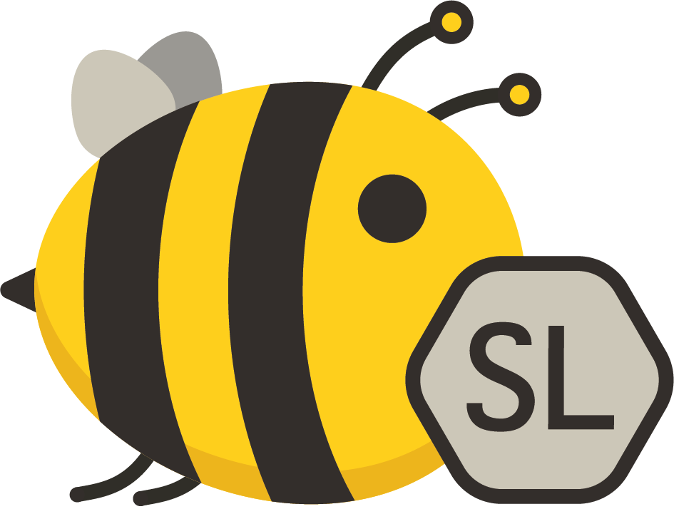
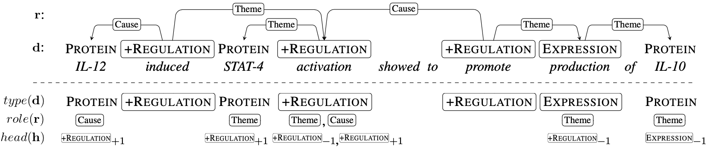

# Biomedical Event Extraction as Sequence Labeling (BeeSL)

BeeSL is a deep learning solution that is fast, accurate, end-to-end, and unlike current methods does not require any external knowledge base or preprocessing tools as it builds on [BERT](https://www.aclweb.org/anthology/N19-1423/). Empirical results show that BeeSL's speed and accuracy makes it a viable approach for large-scale real-world scenarios.

This repository contains the source code for [Biomedical Event Extraction as Sequence Labeling](https://www.researchgate.net/publication/344541520_Biomedical_Event_Extraction_as_Sequence_Labeling) (BeeSL). You may freely use [this work](#reference-and-contact) in your research and activities under the non-commercial [COSBI-SSLA license](https://www.cosbi.eu/research/prototypes/licence_terms).

For more information on ongoing work in biomedical information extraction you may want to visit the [COSBI knowledge extraction page](https://www.cosbi.eu/research/prototypes/biomedical_knowledge_extraction) or get in touch with the Cosbi Bioinformatics lab led by lombardo@cosbi.eu.

## Table of contents

- [How does BeeSL work (in short)?](#how-does-beesl-work)
- [Installation](#installation)
- [Usage](#usage)
  + [Event extraction (prediction)](#event-extraction-prediction)
  + [Training a new model](#training-a-new-model)
- [File formats and configuration](#file-formats-and-configuration)
- [Reference](#reference-and-contact)


# How does BeeSL work?

Biomedical events are structured representations which comprise multiple information units (Figure 1, above the line). We convert the event structures into a representation in which each token (roughly, word) is assigned the following community-agreed labels summarizing its pertinent parts of the original event structure (Figure 1, below the line):
- **d**ependent or, *type of mention*, the token assumes in the event, either an *event trigger*, an *entity*, or *nothing*;
- **r**elation or, *thematic role*, the argument token is playing in the event it is participating in;
- **h**ead: the event anchor, is labelled with the event category and position of the event verb the token refers to.


**Figure 1**: *Above the dashed line: an (italicized) text excerpt with four biomedical events. The (boxed) triggers and entities represent the dependent mentions shown above the text. Thematic roles of arguments are on the edges. Below the dashes: our proposed encoding, for **d**ependents, **r**elations and **h**eads represent the labels. See the [paper](https://www.researchgate.net/publication/344541520_Biomedical_Event_Extraction_as_Sequence_Labeling) for more details.*

At this point we recast event extraction as a sequence labeling task as any token may have multiple associated labels. Adopting a system thinking approach, we design a multi-label aware encoding strategy for jointly modeling the intermediate tasks via multi-task learning.

After encoding events as a sequence of labels the labels for the token sequences are predicted using a neural architecture employing BERT as encoder. Dedicated classifiers for predicting the label parts (referred as tasks) are devised. Experimental results show that the best results are achieved by learning two tasks in a multi-task setup. A single label classifier for the **d**ependent, and a multi-label classifier for **r**elation and **h**ead `<`**r**,**h**`>` able to capture the participation of the same token into multiple events. The sequences are finally decoded to the original event representation (Figure 1, top part).


# Installation

It is recommended to install an environment management system (e.g., [miniconda3](https://docs.conda.io/en/latest/miniconda.html)) to avoid conflicts with other programs. After installing miniconda3, create the environment and install the requirements:
```
cd $BEESL_DIR                             # the folder where you put this codebase
conda create --name beesl-env python=3.7  # create an python 3.7 env called beesl-env
conda activate beesl-env                  # activate the environment
python -m pip install -r requirements.txt # install the packages from requirements.txt
```
**NOTE**: we have tried hard, but there is no easy way to ship the installation of conda across operating systems and users, therefore this step is a necessary manual operation to do.

Download the pre-trained [BioBERT-Base v1.1 (+ PubMed 1M) model](https://github.com/dmis-lab/biobert "here") and run:
```
# Extract the model, convert it to pytorch, and clean the directory
tar xC models -f $DOWNLOAD_DIR/biobert_v1.1_pubmed.tar.gz 
pytorch_transformers bert models/biobert_v1.1_pubmed/model.ckpt-1000000 models/biobert_v1.1_pubmed/bert_config.json models/biobert_v1.1_pubmed/pytorch_model.bin
rm models/biobert_v1.1_pubmed/model.ckpt*
```
Download the GENIA event data with our automatized script:
```
sh download_data.sh
```
Download the BeeSL model described in the [paper](#reference-and-contact).
```
curl -O https://www.cosbi.eu/fx/2354/model.tar.gz
```
#### Installing the predictive model
Place the downloaded model https://www.cosbi.eu/fx/2354/model.tar.gz in `beesl/models/beesl-model/`. In that folder you may later place your [own trained models](#training-a-new-model). The models are declared in the file config/params.json, setting the parameter `pretrained_model`. The provided [`config/params.json`](config/params.json) already references the model at that path. If you place the model somewhere else, make sure to update the configuration.


You now have everything in place and are ready to start using the system.


# Usage

While this is a research product, the quality reached by the system makes it suitable to be used in real research settings for [event detection](#event-extraction-prediction) and [training new models](#training-a-new-model) of your own. 


## Event extraction (prediction)

To detect biomedical events, run:
```
python predict.py $PATH_TO_MODEL $BEESL_INPUT_FILE $PREDICTIONS_FILE --device $DEVICE
```

The arguments are
* `$PATH_TO_MODEL`: a serialized model fine-tuned on biomedical events, for example the one provided above at https://www.cosbi.eu/fx/2354/model.tar.gz.
* `$BEESL_INPUT_FILE`: a BeeSL format with entities masked (see [how to make it](#beesl-data-format)). For example the provided [`$BEESL_DIR/data/GE11/masked/test.mt.1`](data/GE11/masked/test.mt.1).
* `$PREDICTIONS_FILE`: the predictions of events in BeeSL format
* `$DEVICE`: a device where to run the inference (i.e., CPU: `-1`, GPU: `0`, `1`, ...)

To collect the detected event parts and text portions `{{TODO}}`

The following two lines will create the folder `output/` in the BeeSL root project populated with the predictions in [BioNLP standoff format](http://2011.bionlp-st.org/home/file-formats):

```
# Merge predicted labels
python bio-mergeBack.py $PREDICTIONS_FILE $BEESL_INPUT_FILE 2 > $PREDICTIONS_NOT_MASKED
# Convert them back to the BioNLP standoff format
python bioscripts/postprocess.py --filepath $PREDICTIONS_NOT_MASKED
```

To evaluate the prediction performance on the GENIA test set, compress the results `cd $BEESL_DIR/output/ && tar -czf predictions.tar.gz *.a2` and submit `predictions.tar.gz` to the official [GENIA online evaluation service](http://bionlp-st.dbcls.jp/GE/2011/eval-test/).


## Training a new model

To train a new model type:

```
python train.py --name $NAME --dataset_config $DATASET_CONFIG --parameters_config $PARAMETERS_CONFIG --device $DEVICE
```
* `$NAME`: a name for the execution that will be used as folder where outputs will be stored
* `$DATASET_CONFIG`: a filepath to a config file storing [task information](#dataset-configuration-file)
  * e.g., [`$BEESL_DIR/config/mt.1.mh.0.50.json`](config/mt.1.mh.0.50.json) we provide (recommended), or your own one
* `$PARAMETERS_CONFIG`: a filepath to a config file storing [model parameters](#parameters-configuration-file)
  * e.g., [`$BEESL_DIR/config/params.json`](config/params.json) we provide (recommended), or your own one
* `$DEVICE`: a device where to run the training (i.e., CPU: `-1`, GPU: `0`, `1`, ...)

The serialized model will be stored in `beesl/logs/$NAME/$DATETIME/model.tar.gz`, where `$DATETIME` is a folder to disambiguate multiple executions with the same `$NAME`. A performance report will be in `beesl/logs/$NAME/$DATETIME/results.txt`. To use your newly trained model to [predict](#event-extraction-prediction) new data see the [installation instructions](#installing-the-predictive-model) above.


# File formats and configuration

## BeeSL data format

Biomedical events are commonly defined using the standard [BioNLP standoff format](http://2011.bionlp-st.org/home/file-formats). To convert the BioNLP standoff biomedical events format into BeeSL format, run the two commands:
```
python bioscripts/preprocess.py --corpus $CORPUS_FOLDER --masking type
python bioscripts/preprocess.py --corpus $CORPUS_FOLDER --masking no
```
`$CORPUS_FOLDER` is the folder in `$BEESL_DIR/data/corpora/` containing biomedical events in the standard BioNLP standoff format, e.g., `GE11` you just downloaded.

The masking is used during training and evaluation to avoid overfitting to word types during training (argument `type` e.g. `$PROTEIN` in the example below) and to ensure the correct evaluation of entity arguments (the argument `no`).

For event extraction (no training nor evaluation) `{{TODO}}`

**Details on the BeeSL file format**
The BeeSL file format makes explicit the sequence of labels proved to boost perfomances. Each sentence starts with a header `doc_id = $DOC_ID` denoting the sentence identifier. All sentence tokens are then placed one per line. An empty line follows the last token. Note that senteces can be at most 768 tokens long as per BERT model input.

Here is the specification, followed by an excerpt of a [full example](data/GE11/masked/test.mt.1):
```
# doc_id = $DOC_ID
$TOKEN_TEXT  $START-$END  $ENTITY_ID  $ENT_TYPE $EXTRA  $EXTRA      $LABEL(1) ... $LABEL(n)
```
Excerpt:
```
# doc_id = PMC-1064873-00-TIAB
Resistance   0-10         O           [ENT]-    [POS]NOUN [DEP]ROOT   O       O
to           11-13        O           [ENT]-    [POS]PART [DEP]case   O       O
$PROTEIN$    14-19        T1          [ENT]Protein [POS]NOUN [DEP]compound   O       O
inhibition   20-30        O           [ENT]-    [POS]NOUN [DEP]nmod   O       O
of           31-33        O           [ENT]-    [POS]ADP  [DEP]case   O       O
$PROTEIN$    34-50        T2          [ENT]Protein [POS]NOUN [DEP]compound   O       O
production   51-61        O           [ENT]-    [POS]NOUN [DEP]nmod   O       O
and          62-65        O           [ENT]-    [POS]CCONJ [DEP]cc    O       O
expression   66-76        O           [ENT]-    [POS]NOUN [DEP]conj   O       O
of           77-79        O           [ENT]-    [POS]ADP  [DEP]case   O       O
$PROTEIN$    80-114       T3          [ENT]Protein [POS]NOUN [DEP]nmod O       O
in           115-117      O           [ENT]-    [POS]ADP  [DEP]case   O       O
$PROTEIN$    118-121      T4          [ENT]Protein [POS]NOUN [DEP]compound O       O
+            121-122      O           [ENT]-    [POS]CCONJ [DEP]cc    O       O
T            123-124      O           [ENT]-    [POS]NOUN [DEP]conj   O       O
cells        125-130      O           [ENT]-    [POS]NOUN [DEP]nmod   O       O
from         131-135      O           [ENT]-    [POS]ADP  [DEP]case   O       O
patients     136-144      O           [ENT]-    [POS]NOUN [DEP]nmod   O       O
with         145-149      O           [ENT]-    [POS]ADP  [DEP]case   O       O
rheumatoid   150-160      O           [ENT]-    [POS]ADJ  [DEP]amod   O       O
arthritis    161-170      O           [ENT]-    [POS]NOUN [DEP]nmod   O       O

# doc_id = PMC-1064873-00-TIAB
$PROTEIN$    172-177   T5             [ENT]Protein [POS]NOUN [DEP]nsubjpass O       O
has          178-181   O              [ENT]-    [POS]AUX  [DEP]aux    O       O
...
```

Where:

- `$TOKEN_TEXT`: the text of the token (or a masked version, as described above)
- `$START-$END`: the `start` and `end` offsets of the token with respect to the document
- `$ENTITY_ID`: the entity id, if any. If not an entity, `O` is printed
- `$ENT_TYPE`: the entity type, if any. If not an entity, `-` is printed
- `$EXTRA`: any extra information (not needed for the computation)
- `$LABEL(i)`: a label part. You can have many columns as the number of tasks, 3 in the example.

## Configuration files

The training process requires configuration files to know how to conduct the training itself. For more information on possible keys refer to the original [AllenNLP configuration template](https://github.com/allenai/allennlp-template-config-files/blob/master/training_config/my_model_trained_on_my_dataset.jsonnet), on which our configuration files are based.

### Dataset configuration file

A dataset configuration file is used to define the data path and details on the tasks. **We recommend to use our configuration file for the multi-task multi-label setup [`$BEESL_DIR/config/mt.1.mh.0.50.json`](config/mt.1.mh.0.50.json)**. In the case you need to train BeeSL on new data, you need to define the path to your data (we explained how to create these data files in the [Token-level data format](#token-level-data-format) section):

```
"train_data_path": "",      # path to the masked token-level training file
"validation_data_path": "", # path to the masked token-level validation file
"test_data_path": "",       # path to the masked token-level validation file
```

### Parameters configuration file

A parameters configuration file is used to define the details of the model (i.e., hyper-parameters, BERT details, etc.). **We recommend to use our parameters configuration file [`$BEESL_DIR/config/params.json`](config/params.json)**. Expert users that want to run an hyper-parameter tuning themselves can refer to the [AllenNLP configuration template](https://github.com/allenai/allennlp-template-config-files/blob/master/training_config/my_model_trained_on_my_dataset.jsonnet) for the meaning of all keys in the `json` file.


# Reference and Contact

If you use this work in your research paper, we provide the full citation details for your reference.

```
@inproceedings{ramponi-etal-2020-biomedical,
    title     = "{B}iomedical {E}vent {E}xtraction as {S}equence {L}abeling",
    author    = "Ramponi, Alan and van der Goot, Rob and Lombardo, Rosario and Plank, Barbara",
    year      = "2020",
    booktitle = "Proceedings of the 2020 Conference on Empirical Methods in Natural Language Processing (EMNLP)",
    publisher = "Association for Computational Linguistics",
    pages     = "", % we will update this field when available
    location  = "Online",
    url       = ""  % we will update this field when available
}
```

For any information or request you may want to get in touch with the Cosbi Bioformatics lab led by lombardo@cosbi.eu. We'll be happy to help!
